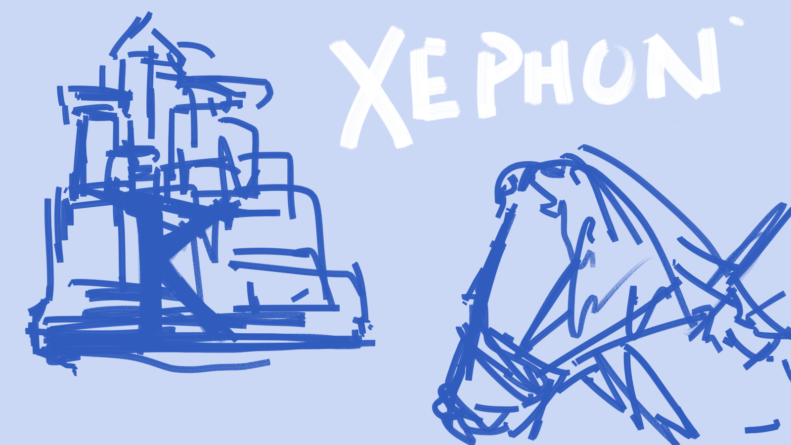

# Logo

All the logo I have drawn

- [personal](#personal)
  - [Doc viewer](#doc-viewer)
- [dyweb](#dongyue-web-studio)
  - [Postman](#postman)
  - [Ring](#ring)

## Personal

### doc-viewer

- https://github.com/at15/doc-viewer
  - very early project when learning Node.js, it is still working, should be integerated into [Ayi](https://github.com/dyweb/Ayi) in the future

## Dongyue Web Studio

### ring

- https://github.com/dyweb/ring mainly worked by [@xsfour](https://github.com/xsfour) and me, used in some internal CMS projects

### postman

- https://github.com/dyweb/postman
 - https://github.com/at15/postman

## Xephonhq

Most of my grad school projects are related with time series database, Xephon comes form anime RaXephon

### Xephon-B

A time series benchmark framework, b stands for benchmark and berserker, wrote in CMPS232

- https://github.com/xephonhq/xephon-b

### Xephon-K

A time series database with multiple backends, the first one is based on Cassandra, CMPS278,
the second one is very similar to InfluxDB's TSM, it should be called [Xephon-S](https://github.com/xephonhq/xephon-s),
but due to package management, both Xephon-B and Xephon-S end up in Xephon-K

- https://github.com/xephonhq/xephon-k

